# Edge Knowledge Manager: Full Project Deep Dive

## Executive Summary

Edge Knowledge Manager is a local-first Retrieval-Augmented Generation (RAG) system for private PDFs. Its main purpose is to let a user ingest documents once, persist them in a lightweight vector database, and ask questions later using a language model while keeping the retrieval layer fast, private, and suitable for modest hardware such as a Raspberry Pi 5 or a typical laptop.

The project is intentionally not built as a heavy cloud-native stack. Instead, it uses embedded Chroma persistence, local embedding generation, and a single Python process for ingestion, retrieval, query answering, and evaluation. The design emphasizes practical tradeoffs:

- low operational overhead
- strong portability
- sufficient accuracy for private document Q&A
- easy inspection and debugging
- reproducible evaluations

This document explains the entire project in depth. It is intentionally much more detailed than a normal README. It covers the objective of the system, the theory behind the retrieval techniques, how each module works, how each API behaves, how evaluation is done, how vector databases work, and why the project is structured the way it is.

---

## Table of Contents

1. Project objective
2. Problem statement and design constraints
3. System architecture
4. Repository layout
5. Tech stack
6. End-to-end data flow
7. Document ingestion pipeline
8. Metadata-augmented chunking
9. Embeddings: theory and implementation
10. Vector databases: theory and practical behavior
11. Retrieval modes: vector, BM25, and hybrid
12. Max Marginal Relevance (MMR)
13. Cross-encoder reranking
14. Prompt assembly and answer generation
15. ReAct-style tool loop
16. FastAPI interface
17. CLI interface
18. Evaluation framework with Ragas
19. SQuAD ingestion and synthetic evaluation data
20. Configuration reference
21. Module-by-module API reference
22. Testing strategy
23. Operational considerations
24. Limitations and future work

---

## 1. Project Objective

The project exists to solve a simple but important problem: people often have private PDFs containing technical notes, reports, manuals, research papers, or internal documentation, and they want to ask questions about those files naturally.

A naive approach would be to feed an entire PDF into a language model. That does not scale well because:

- documents are too long for model context windows
- PDF layout is noisy and hard to read directly
- answers need to be grounded in the document, not hallucinated
- sending full documents to an API can be slow and expensive
- private documents should not require a large external platform just to query them

This project uses RAG to solve that problem in a more controlled way:

1. Parse documents into chunks.
2. Embed those chunks.
3. Store chunks in a local vector database.
4. Retrieve only the most relevant chunks for a user query.
5. Feed retrieved context to an LLM to generate an answer.

The end result is a private, lightweight document assistant that can be deployed locally.

### Why this matters

The objective is not merely to build a chatbot. The objective is to build a system that:

- can be inspected
- can be evaluated
- can be tuned
- can run on edge hardware
- can support multiple retrieval strategies
- can use tool augmentation when needed

That is why the repository contains separate modules for ingestion, retrieval, answer generation, evaluation, and API serving.

---

## 2. Problem Statement and Design Constraints

The project was designed around a few explicit constraints.

### Constraint 1: Low operational overhead

Many production RAG stacks depend on separate services such as PostgreSQL, Redis, Elasticsearch, Qdrant, or managed cloud vector databases. Those are powerful, but they introduce setup cost and ongoing maintenance.

This project chooses embedded Chroma persistence so that the full system can run inside a Python environment without a separate database service.

### Constraint 2: Edge compatibility

The repository is intended to work on machines such as Raspberry Pi 5 and macOS laptops. That means the design cannot assume:

- a dedicated GPU
- large memory headroom
- always-on server infrastructure
- enterprise networking or cloud IAM integration

### Constraint 3: Strong enough quality for private document QA

The system has to retrieve relevant evidence with enough reliability to answer real questions, not just demos. That is why it supports:

- metadata-aware chunking
- dense retrieval
- lexical retrieval
- hybrid retrieval
- diversity-aware reranking using MMR
- evaluation with Ragas

### Constraint 4: Simplicity of deployment

The system should be easy to start:

- install dependencies
- set environment variables
- ingest PDF files
- query from CLI or API

There is no special deployment orchestration required for core functionality.

---

## 3. System Architecture

At a high level, the system has two major phases: ingestion and querying.

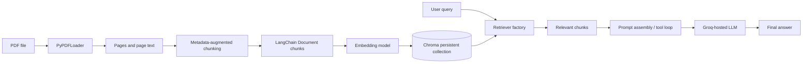

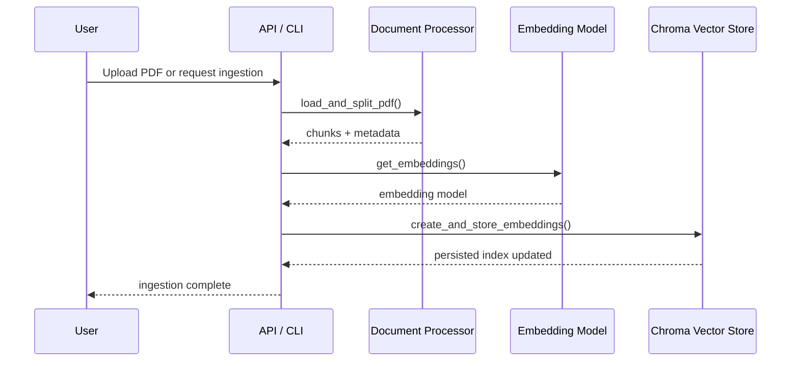

### Ingestion path

The ingestion path transforms a PDF into searchable pieces of text.

### Query path

The query path transforms a user question into a response by retrieving context and passing it into a generation chain.

### Why this architecture is appropriate

This architecture works well because the expensive step is done once during ingestion, while the online query step is cheap enough to run repeatedly.

---

## 4. Repository Layout

The repository is organized so that each concern has a clear home.

- `api.py`: FastAPI server
- `qna.py`: command-line question answering
- `src/main.py`: command-line ingestion entry point
- `src/doc_process.py`: document loading and chunking
- `src/embedding_gen.py`: embedding model setup
- `src/vectorstore_manager.py`: vector store persistence, retriever factory, and document statistics
- `src/rag_processor.py`: tool-enabled RAG orchestration
- `src/evaluate_rag.py`: evaluation pipeline using Ragas
- `src/ingest_squad.py`: SQuAD ingestion and evaluation file generation
- `src/config.py`: centralized configuration
- `tests/`: unit and functional tests
- `docs/CHUNKING.md`: notes about chunking strategy
- `docs/TESTS.md`: notes about test strategy

This structure is useful because it keeps each stage of the pipeline isolated. The chunker can change without changing the API. The retriever can change without changing evaluation. The answer generator can change without changing ingestion.

---

## 5. Tech Stack

The stack is intentionally practical and relatively compact.

### Core libraries

- Python 3.10+
- LangChain ecosystem
- LangGraph
- ChromaDB
- HuggingFace embeddings
- Groq LLM access
- FastAPI and Uvicorn
- Ragas and HuggingFace Datasets
- pytest for tests

### Key package groups

#### Document parsing and chunking

- `pypdf`
- `langchain_community`
- `langchain-text-splitters`
- `langchain_core`

#### Embeddings

- `sentence-transformers`
- `langchain_huggingface`

#### Vector storage and retrieval

- `chromadb`
- `langchain_chroma`
- `rank-bm25`
- LangChain retriever abstractions

#### LLM and orchestration

- `langchain_groq`
- `langgraph`

#### Serving and evaluation

- `fastapi`
- `uvicorn`
- `ragas`
- `datasets`
- `pandas`
- `openpyxl`

### Why this stack was chosen

The stack supports the full pipeline without forcing external infrastructure. Each component is chosen for a concrete function:

- Chroma for persistent retrieval
- sentence-transformers for local embeddings
- Groq for high-throughput LLM inference
- LangGraph for tool routing and controlled reasoning
- Ragas for measurable evaluation

---

## 6. End-to-End Data Flow

The full system can be thought of as a pipeline with reusable stages.

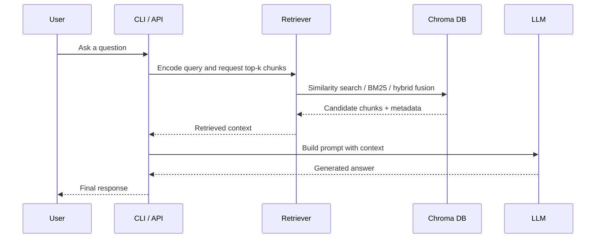

### Step 1: PDF ingestion

A PDF is loaded and split into pages.

### Step 2: Text segmentation

Pages are split into paragraphs and, when necessary, into smaller sub-chunks.

### Step 3: Metadata enrichment

Each chunk gets metadata such as page number, section heading, character offsets, and chunk identifier.

### Step 4: Embedding generation

Text chunks are converted into dense vectors.

### Step 5: Vector persistence

Vectors and text are written into a Chroma collection.

### Step 6: Query embedding

A user query is converted into an embedding.

### Step 7: Candidate retrieval

The system fetches relevant chunks using one of the supported retrieval modes.

### Step 8: Reranking and fusion

Depending on configuration, vector retrieval may use MMR and hybrid retrieval may combine dense and lexical ranking.

### Step 9: Answer generation

The LLM produces the final answer using the retrieved context.

### Step 10: Evaluation

The same retrieval pipeline is used in a benchmark loop with Ragas metrics.

This consistency is important. Evaluating a different pipeline from the one used in production gives misleading results.

---

## 7. Document Ingestion Pipeline

The ingestion logic is implemented across `src/main.py`, `api.py`, `src/doc_process.py`, `src/embedding_gen.py`, and `src/vectorstore_manager.py`.

### Ingestion entry points

There are two user-facing ingestion paths:

1. CLI ingestion via `python -m src.main --pdf <path>`
2. API ingestion via `POST /ingest`

Both paths eventually call the same core logic.

### What ingestion does

Ingestion is the process of turning a PDF into persistent searchable chunks.

1. The PDF is parsed using `PyPDFLoader`.
2. The document text is split into chunks.
3. Embeddings are generated for each chunk.
4. The chunks and vectors are stored in Chroma.

### Why ingestion is separated from querying

Ingestion is expensive relative to querying because it must:

- read and parse documents
- split text carefully
- generate embeddings for many chunks
- persist the index

By separating ingestion from query time, the system can keep the online path fast.

---

## 8. Metadata-Augmented Chunking

Chunking is one of the most important parts of RAG quality. If chunking is poor, retrieval quality degrades no matter how good the embedding model is.

The project uses metadata-augmented chunking to preserve structure and make retrieval easier to reason about.

### Why chunking matters

A PDF is not naturally a clean sequence of paragraphs. It can contain:

- headings
- section titles
- line breaks from formatting rather than semantics
- repeated headers or footers
- tables and mixed layout content

If you split too aggressively, you lose context. If you split too loosely, you exceed model context limits and retrieve too much irrelevant content.

### Implementation strategy

The chunker in `src/doc_process.py` follows a hybrid heuristic:

1. Load pages with `PyPDFLoader`.
2. Split each page into paragraphs using double newlines.
3. Detect headings using a simple heuristic.
4. Track the current section as state while scanning the page.
5. Keep short paragraphs as chunks.
6. Split longer paragraphs with `RecursiveCharacterTextSplitter`.
7. Attach metadata to every chunk.

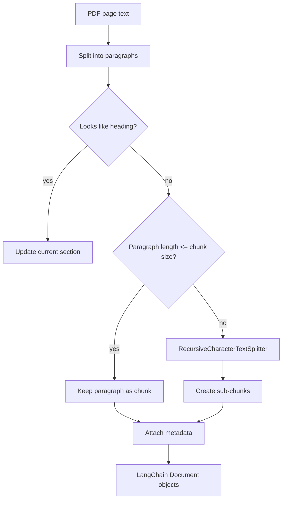

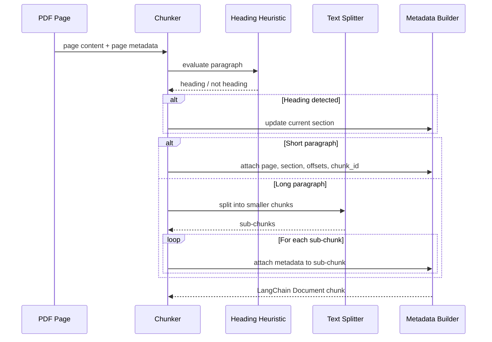

### The heading heuristic

The code uses `_is_heading(text)` to identify likely section titles.

It treats text as a heading if it is:

- short
- all caps
- title-like
- ending in a colon
- not a full sentence

This heuristic is not perfect, but it is fast and cheap, which matters for edge usage.

### Why section metadata helps

When a chunk is tagged with a section name, the system can later use that information to:

- debug retrieval
- group adjacent chunks mentally
- understand which part of the document produced an answer
- support future retrieval filtering or section-aware ranking

### Why character offsets help

The chunk metadata also stores `start_char` and `end_char` as best-effort offsets into the page text. These offsets are useful for debugging because they help you inspect exactly where a retrieved chunk came from.

### Design tradeoff

A more sophisticated chunker could use:

- layout-aware PDF parsing
- OCR for scanned PDFs
- table extraction
- hierarchical section trees

But this repository prioritizes a good balance of quality and simplicity.

---

## 9. Embeddings: Theory and Implementation

Embeddings are the bridge between text and vector search.

### Core idea

An embedding model maps a piece of text into a point in a high-dimensional vector space. Texts that are semantically similar should lie near each other in that space.

For example:

- “What does the document conclude?”
- “What are the main findings?”

should produce embeddings that are close enough for retrieval to consider them related, even if the exact words differ.

### Why embeddings are useful

Embeddings let us search by meaning rather than exact matching. That is especially useful for natural language queries.

### How they work conceptually

At a high level, embedding models are trained so that:

- related phrases produce vectors with small distance
- unrelated phrases produce vectors with larger distance

The similarity is often computed via cosine similarity or inner product.

### The embedding model in this project

The project uses:

- `sentence-transformers/static-retrieval-mrl-en-v1`

via LangChain’s `HuggingFaceEmbeddings` wrapper.

### Why CPU embeddings are the default

The repository defaults to CPU execution because the target environment includes edge devices. A CPU-friendly setup is much easier to run reliably and deploy consistently.

### The practical role of embeddings in RAG

Embeddings are used in two places:

1. Ingesting chunks into the vector store.
2. Encoding the user query at retrieval time.

This symmetry is essential. The database and the query must live in the same embedding space, otherwise similarity search does not work meaningfully.

---

## 10. Vector Databases: Theory and Practical Behavior

A vector database is a storage and retrieval system optimized for vectors rather than rows or documents alone.

### What is stored in this project

Each chunk stored in Chroma contains:

- the chunk text
- the embedding vector
- the associated metadata

### What happens at query time

When a user asks a question, the query is embedded into a vector. The vector database then finds the nearest stored chunk vectors.

### Why “nearest” matters

A vector database is performing approximate semantic retrieval. It is not looking for literal text matches only. It is looking for nearby points in the embedding space.

### Why persistence matters

This project uses a persistent Chroma collection on disk, so the vector store survives restarts.

The persistence directory is configured as `db/` and the collection name is `my_documents`.

### Why embedded mode is useful

Embedded mode means Chroma runs as a library in the Python process rather than as a separate service. This reduces operational complexity, makes the project easier to install, and avoids the need for Docker or a managed DB in the basic setup.

### ANN intuition

Most vector search systems do not compare every vector to every query vector in an exact brute-force way once the corpus gets large. Instead, they use Approximate Nearest Neighbor techniques.

The practical consequence is:

- search is much faster than exhaustive comparison
- results are approximate but usually good enough
- quality and speed can be tuned by index choice and search parameters

Even if the internal ANN implementation is abstracted away by Chroma, the conceptual model still matters.

### Why metadata matters in a vector DB

Vectors alone are not enough. Metadata gives you:

- source file name
- page information
- section information
- chunk identifiers
- debugging hints

Without metadata, vector search becomes harder to explain and validate.

### Tradeoff between semantic and lexical retrieval

Vector databases excel when meaning matters, but they can underperform on:

- exact names
- code identifiers
- acronyms
- numeric queries
- highly specific phrase matches

That is why this project does not rely solely on dense retrieval.

---

## 11. Retrieval Modes

Retrieval is managed in `src/vectorstore_manager.get_retriever()`.

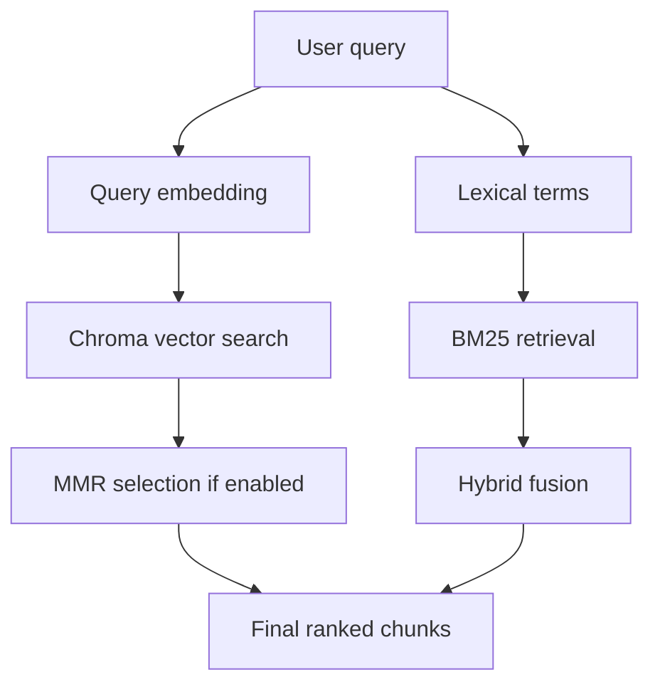

### 11.1 Vector retrieval

Vector retrieval is the default semantic mode. Chroma returns the nearest vectors for the query embedding.

#### Strengths

- captures semantic similarity
- works well for paraphrases
- good for questions phrased differently from the document wording

#### Weaknesses

- can miss exact keyword matches
- may return redundant chunks
- can retrieve semantically similar but not directly relevant chunks

### 11.2 BM25 retrieval

BM25 is a classic lexical retrieval method.

#### Theory

BM25 scores documents using term frequency, inverse document frequency, and document length normalization.

Informally, BM25 asks:

- how often does the query term appear in the document?
- how rare is that term across the corpus?
- is the document unusually long or short?

This makes BM25 strong when exact terms matter.

#### Strengths

- exact phrase sensitivity
- strong on rare terms and named entities
- intuitive behavior

#### Weaknesses

- weak on paraphrases
- does not understand semantics deeply
- can miss conceptually related passages with different wording

### 11.3 Hybrid retrieval

Hybrid retrieval combines vector and BM25 retrieval so the system can benefit from both semantic and lexical signals.

#### Why hybrid helps

Dense retrieval may find the right topic, while BM25 may find the exact term. Combining both often improves recall and robustness.

#### Fusion behavior

When `EnsembleRetriever` is available, it fuses ranked outputs using weights. When the library version lacks the expected class, the repository includes a compatibility fallback that applies weighted reciprocal-rank-style scoring.

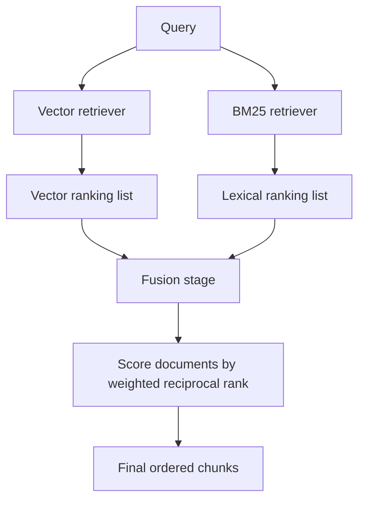

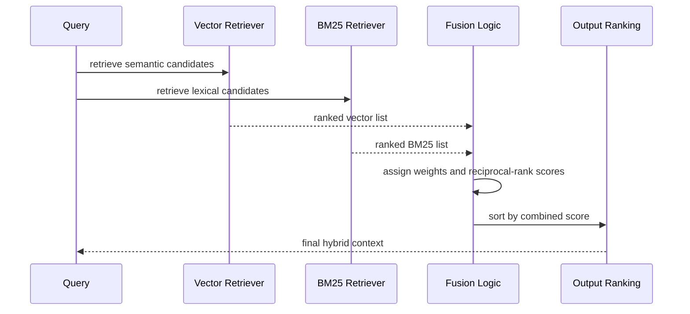

The core idea is simple:

- a document ranked highly by one retriever should receive more credit
- a document ranked consistently by multiple retrievers should rise further

#### Practical tuning

The project exposes `HYBRID_WEIGHTS` so you can bias retrieval toward either semantic or lexical signals.

For example:

- `[0.7, 0.3]` favors vector retrieval
- `[0.5, 0.5]` balances both more equally

### 11.4 The role of top-k

The `TOP_K` setting controls how many chunks are returned to the final prompt.

This number is a key tuning parameter because it affects:

- recall
- prompt length
- token cost
- answer faithfulness
- answer verbosity

Too small and the model misses evidence. Too large and the model gets noisy or expensive.

---

## 12. Max Marginal Relevance (MMR)

MMR is one of the most important retrieval concepts used in this project.

### The problem MMR solves

Naive nearest-neighbor retrieval often returns documents that are all extremely similar to each other. This happens because the top semantic matches are often near-duplicates or overlapping fragments.

That creates two problems:

1. The prompt wastes tokens repeating the same evidence.
2. The model sees less variety in the retrieved context, which can reduce coverage.

### MMR intuition

MMR tries to keep results relevant while also maximizing diversity.

Instead of selecting the top chunk repeatedly from a similarity ranking, it picks chunks one by one, each time considering:

- similarity to the query
- similarity to chunks already selected

### The MMR formula

A common form of MMR selection is:

$$
\arg\max_{d \in D \setminus S} \left[ \lambda \cdot sim(q,d) - (1-\lambda) \cdot \max_{d' \in S} sim(d,d') \right]
$$

Where:

- $q$ is the query
- $d$ is a candidate document or chunk
- $S$ is the set of already selected chunks
- $sim$ is a similarity function, typically cosine similarity
- $\lambda$ balances relevance and diversity

### Interpreting lambda

- If $\lambda = 1.0$, the system focuses almost entirely on relevance.
- If $\lambda = 0.0$, the system prioritizes diversity strongly.
- Middle values strike a balance.

### Why diversity matters in RAG

Imagine a document with a repeated concept across adjacent chunks. If the retriever returns five nearly identical chunks, the model gets little additional information beyond the first one. MMR improves the usefulness of context by selecting chunks that cover different evidence.

### MMR in this codebase

The Chroma retriever is configured with MMR when `MMR_ENABLED = True`.

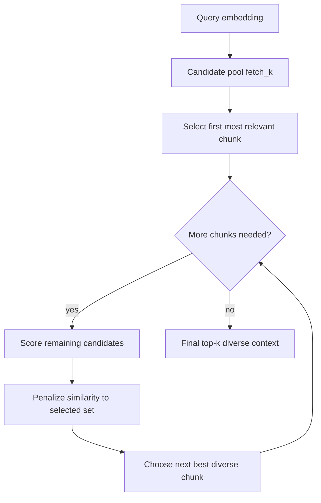

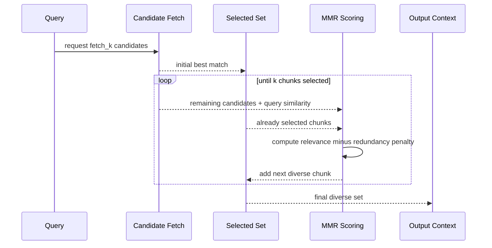

Relevant parameters:

- `MMR_FETCH_K`: number of candidate chunks to examine before selecting final chunks
- `MMR_LAMBDA_MULT`: relevance/diversity tradeoff
- `TOP_K`: final output size

### Why `fetch_k` matters

MMR cannot diversify a set unless it has a sufficiently large candidate pool. If `fetch_k` is too small, MMR has too little to work with.

That is why the project constrains `MMR_FETCH_K` to be at least `TOP_K` and recommends a larger pool.

### Why MMR fits this project well

The project is about private PDFs, where many chunks overlap semantically. MMR is especially useful there because documents often have repeated vocabulary, repeated headings, and adjacent paragraphs on the same topic.

---

## 13. Cross-Encoder Reranking

Cross-encoder reranking is not currently implemented in the runtime code, but it is an important theoretical concept and it is referenced in the project report text.

### What a cross-encoder is

A cross-encoder takes the query and candidate document together as a pair and processes them jointly.

This differs from a bi-encoder or embedding model, where the query and document are encoded separately.

### Why cross-encoders are stronger

Cross-encoders can model fine-grained interactions between the query and the candidate text. That allows them to score relevance more precisely than pure embedding similarity.

For example, a cross-encoder can pay attention to exact word interactions, negation, entity alignment, and phrase-level relevance.

### Why they are more expensive

The tradeoff is cost. If you have 50 candidate chunks, a cross-encoder must score each query-chunk pair separately. That makes it significantly slower than one query embedding compared against many chunk embeddings.

### Typical reranking pipeline

A common setup is:

1. Use a fast retriever to get a candidate set of 20 to 100 chunks.
2. Feed those candidates into a cross-encoder.
3. Rerank the candidates by predicted relevance.
4. Return the top few chunks to the prompt.

### Why the repository does not currently use it by default

This repository is edge-oriented. Cross-encoders are typically too heavy for small devices unless carefully optimized.

So the current implementation chooses MMR as a lightweight reranking alternative.

### How cross-encoder reranking differs from MMR

MMR focuses on diversity.

Cross-encoder reranking focuses on relevance precision.

These are complementary rather than identical.

- MMR answers: “Which chunks are relevant and non-redundant?”
- Cross-encoder answers: “Which chunks are truly the most relevant to this exact query?”

### Where it would fit in the architecture

If added later, cross-encoder reranking would naturally sit after candidate retrieval and before final prompt assembly.

The pipeline would be:

- dense or hybrid retrieval
- candidate expansion
- cross-encoder scoring
- final top-k selection

### Why it is important to understand even when absent

A complete understanding of the retrieval stack requires understanding the tradeoff between semantic embedding retrieval, diversity-based reranking, and precision-based reranking. This project currently implements the first two. The third is a natural future enhancement.

---

## 14. Prompt Assembly and Answer Generation

The answer generation logic is in `src/rag_processor.py`.

### Basic generation model

The project uses a prompt of the form:

- instruct the assistant to answer using retrieved context
- say to respond concisely
- ask the model to say it does not know if the context is insufficient

This is a classic RAG prompt structure because it nudges the model toward grounded, concise answers.

### Why prompt structure matters

Even with good retrieval, the prompt affects output quality a lot.

A weak prompt can lead to:

- hallucinations
- overly long answers
- answers that ignore the retrieved context
- inconsistent tone

A clear prompt helps constrain the model to the available evidence.

### Context formatting

The retrieved chunks are joined with separators so the model can distinguish one chunk from another.

This reduces confusion when multiple chunks are included in the final context.

### The role of the answer generator

The generator is not responsible for finding evidence. That job belongs to retrieval. The generator is responsible for synthesizing and presenting the answer based on what was retrieved.

This division of labor is core to RAG.

---

## 15. ReAct-Style Tool Loop

The project uses a tool-enabled reasoning loop through LangGraph.

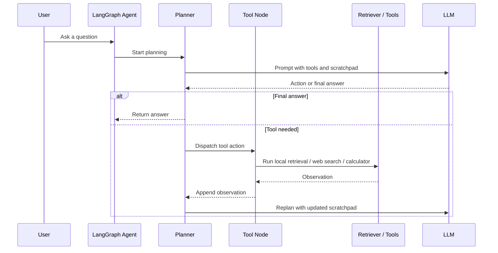

### What ReAct means

ReAct is a reasoning pattern that alternates between:

- reasoning about the task
- taking an action with a tool
- observing the result
- reasoning again

This is useful when a question may need more than one kind of evidence.

### Tools in this repository

The runtime can use:

1. Local retriever
2. Web search through Serper
3. A restricted math calculator

### Why use a tool loop

A pure retrieval-only RAG system works well for document questions. But sometimes a user asks for:

- recent public information
- arithmetic
- a blend of local and fresh information

The ReAct loop allows the system to decide whether to use tools instead of always behaving the same way.

### The planner and tool cycle

The graph in `src/rag_processor.py` includes:

- a planner node
- a tool node
- a fallback node

The planner decides whether to answer immediately or call a tool.
The tool node executes the selected action.
The fallback node synthesizes a final response if the graph reaches its step limit.

### Why bounded steps matter

Without a step limit, the agent could loop indefinitely. The graph therefore has a maximum number of steps (`REACT_MAX_STEPS`).

This is especially important for reliability on edge systems and in API contexts.

### Calculator safety

The math tool does not evaluate arbitrary Python. It parses a restricted AST and only permits known-safe math operations and functions.

That is an important security choice. It prevents the tool from becoming a code execution vector.

### Web search integration

The web search tool uses Serper if API keys are available. This is useful for queries that need freshness rather than static document knowledge.

### Why this matters in a RAG system

A strict document-only system can fail on time-sensitive queries. A tool-augmented system can supplement local documents with recent public information when needed.

---

## 16. FastAPI Interface

The main server is `api.py`.

### Why FastAPI is used

FastAPI gives the project:

- typed request and response models
- easy JSON endpoints
- good performance
- easy integration with other frontend or service code

### Startup behavior

The API loads the embedding model during startup so it can be reused across requests. This reduces latency after the first initialization.

### Endpoint overview

#### `GET /`

A simple health check.

It confirms the service is up and responding.

#### `POST /ingest`

Upload a PDF and ingest it into Chroma.

Request:

- multipart file upload
- field name: `file`
- only PDF files are accepted

Behavior:

- save file temporarily
- parse and split
- embed chunks
- persist to vector store
- delete temporary file

Response:

- message
- filename
- chunk count

#### `POST /query`

Run a question through the RAG chain.

Request body:

```json
{"query": "..."}
```

Response body:

```json
{"query": "...", "answer": "..."}
```

#### `POST /preview_prompt`

Return the retrieved documents and assembled prompt.

This is a debugging endpoint.

It is particularly useful for inspecting:

- what chunks were retrieved
- what metadata was attached
- how much context was assembled
- whether the prompt is too large or too small

#### `GET /documents/statistics`

Return document statistics from the vector store.

This includes:

- total documents
- total chunks
- document-by-document chunk counts

### Why these endpoints matter

These endpoints expose the essential capabilities of the entire project in a way that can be integrated with UI code, scripts, or testing tools.

---

## 17. CLI Interface

The CLI is split between ingestion and question answering.

### `src/main.py`

This is the ingestion CLI.

Usage:

```bash
python -m src.main --pdf data/pdfs/your-document.pdf
```

It does the following:

- validates that the file exists
- loads and splits the PDF
- generates embeddings
- stores chunks in Chroma

### `qna.py`

This is the question-answering CLI.

Usage:

```bash
python -m qna --query "What does the document say about X?"
```

Optional flags:

- `--use-web-search`
- `--disable-math-tool`

### Why the CLI matters

The CLI is useful because it gives you a fast local interface for development and testing without needing to run an HTTP server.

---

## 18. Evaluation Framework with Ragas

Evaluation is implemented in `src/evaluate_rag.py`.

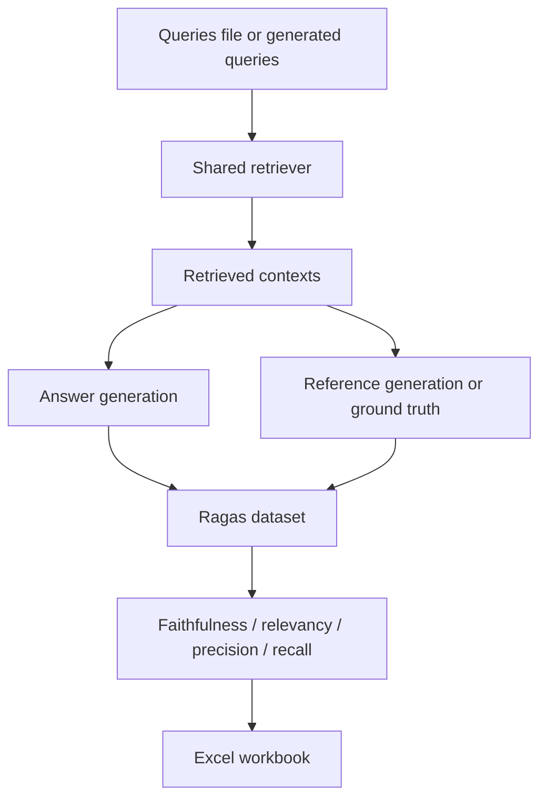

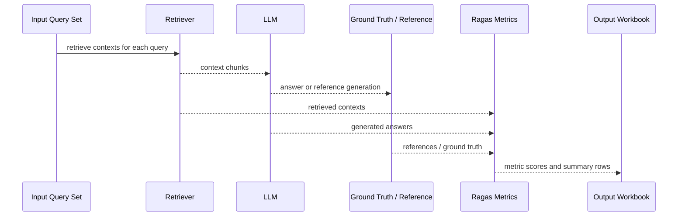

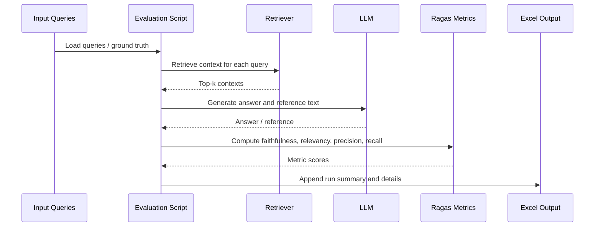

### Why evaluation is necessary

RAG systems can look good in demos and still perform poorly under measurement. Evaluation matters because it helps you understand:

- whether retrieval is bringing back the right evidence
- whether answers are faithful to the evidence
- whether changes to chunking or retrieval improve or degrade quality

### Query sources

The evaluation script supports queries from:

- CSV files
- JSONL files
- synthetic generation from stored chunks

### Ground truth options

If a ground truth file is provided, the script uses it.

Otherwise it can generate a reference answer from the retrieved context.

### Metrics used

The script evaluates with:

- Faithfulness
- Answer relevancy
- Context precision
- Context recall

### What these metrics mean

#### Faithfulness

Measures how much the answer is grounded in the provided context.

#### Answer relevancy

Measures whether the answer actually addresses the question.

#### Context precision

Measures how much of the retrieved context is relevant.

#### Context recall

Measures whether relevant information was actually retrieved.

### Why these metrics matter together

A system can have one strong metric and still be weak overall.

For example:

- high faithfulness but low recall means the model answers correctly from the small amount of context it got, but retrieval is missing important material
- high recall but low precision means retrieval is noisy
- high answer relevancy but low faithfulness may indicate a fluent but hallucinated answer

### Output format

The evaluation script writes results to an Excel workbook:

- a `runs` sheet with summary metrics and configuration
- a timestamped details sheet with per-question results

This makes it easy to compare multiple runs over time.

### Why evaluation uses the same retriever

Evaluation uses the same retriever factory as production paths. That is important because otherwise the metrics would not reflect actual runtime behavior.

---

## 19. SQuAD Ingestion and Synthetic Evaluation Data

The script `src/ingest_squad.py` downloads SQuAD samples and prepares them for evaluation.

### Why this exists

It provides a convenient benchmark-style corpus and query set so you can test the pipeline quickly without authoring all evaluation data by hand.

### What the script does

1. Downloads a subset of SQuAD.
2. Deduplicates contexts.
3. Converts each unique context into a LangChain `Document`.
4. Writes query and ground truth files to `data/`.
5. Optionally clears the current vector store first.
6. Ingests the documents into Chroma.

### Why SQuAD is useful here

SQuAD is helpful because it provides:

- context passages
- questions
- reference answers

That makes it easy to test whether retrieval and answer generation are working in a controlled setting.

---

## 20. Configuration Reference

Configuration is centralized in `src/config.py`.

### Model settings

- `EMBEDDING_MODEL_NAME`
- `EMBEDDING_DEVICE`
- `LLM_MODEL_NAME`

### Web search settings

- `WEB_SEARCH_BACKEND`
- `WEB_SEARCH_ENABLED`
- `SERPER_API_URL`
- `WEB_SEARCH_TIMEOUT_SECONDS`
- `WEB_SEARCH_MAX_RESULTS`
- `WEB_SEARCH_MAX_SNIPPET_CHARS`

### Math tool settings

- `MATH_TOOL_ENABLED`
- `MATH_TOOL_MAX_EXPRESSION_CHARS`
- `MATH_TOOL_DECIMAL_PLACES`

### ReAct settings

- `REACT_MAX_STEPS`
- `REACT_TOOL_OUTPUT_CHARS`

### Retrieval settings

- `PERSIST_DIRECTORY`
- `COLLECTION_NAME`
- `TOP_K`
- `RETRIEVAL_MODE`
- `BM25_K`
- `HYBRID_WEIGHTS`

### MMR settings

- `MMR_ENABLED`
- `MMR_FETCH_K`
- `MMR_LAMBDA_MULT`

### Why config centralization matters

Centralized config makes the system easier to tune and reason about. Instead of changing values in many places, you change them once and keep runtime behavior consistent.

---

## 21. Module-by-Module API Reference

This section summarizes the main callable surfaces of the repository.

### `src/doc_process.py`

#### `load_and_split_pdf(file_path, chunk_size=1000, chunk_overlap=200)`

Loads a PDF, splits it into metadata-rich chunks, and returns a list of LangChain `Document` objects.

#### `_is_heading(text)`

Private heuristic used to detect likely headings or section titles.

---

### `src/embedding_gen.py`

#### `get_embeddings()`

Creates and returns a `HuggingFaceEmbeddings` instance configured with the model and device from `src.config`.

---

### `src/vectorstore_manager.py`

#### `create_and_store_embeddings(documents, embeddings)`

Creates or opens the persistent Chroma collection and stores the document chunks and vectors.

#### `get_retriever(embeddings)`

Builds the retrieval interface using the current retrieval mode and configuration.

Supported behavior includes:

- vector retrieval
- BM25 retrieval
- hybrid retrieval
- MMR reranking for vector paths

#### `get_document_statistics()`

Returns a summary of the number of documents and chunks stored in the vector database.

---

### `src/rag_processor.py`

#### `setup_rag_chain(embeddings, use_web_search=None, use_math_tool=None)`

Builds the complete RAG chain, including retriever, LLM, and tool loop.

#### Internal helpers worth understanding

- `_render_docs_as_context`
- `_serper_web_search`
- `_extract_math_expression`
- `_safe_eval_math_expression`
- `_math_tool_context`
- `_run_react_agent`

These support web retrieval, calculator safety, and agent orchestration.

---

### `api.py`

#### `GET /`

Health check.

#### `POST /ingest`

Ingest a PDF upload.

#### `POST /query`

Ask a question and receive an answer.

#### `POST /preview_prompt`

Inspect retrieved context and prompt assembly.

#### `GET /documents/statistics`

Inspect collection size and document counts.

---

### `qna.py`

#### `main(query, use_web_search=False, use_math_tool=True)`

Initializes embeddings, builds the RAG chain, invokes it, and prints the answer.

---

### `src/main.py`

#### `main(pdf_path)`

Processes a single PDF and stores its chunks into the vector store.

---

### `src/evaluate_rag.py`

#### `load_queries(path)`

Loads query items from CSV or JSONL.

#### `load_ground_truth(path)`

Loads query-to-reference mappings from CSV or JSONL.

#### `build_retriever(embeddings)`

Returns the shared project retriever.

#### `evaluate_with_ragas(retriever, items, k, ground_truth=None)`

Runs the Ragas evaluation loop and returns both summary metrics and detailed results.

#### `append_run_to_excel(excel_path, run_row, details_df)`

Persists the summary and details into an Excel workbook.

#### `main()`

CLI entry point for evaluation.

---

### `src/ingest_squad.py`

#### `clear_vectorstore()`

Deletes the current collection so the dataset can be ingested from a clean state.

#### `download_and_prepare_squad(n_samples=100, split="validation")`

Downloads SQuAD samples, prepares documents, and writes query/ground-truth files.

#### `ingest_documents(documents)`

Embeds and stores the provided documents.

#### `main()`

CLI entry point for SQuAD ingestion.

---

## 22. Testing Strategy

The repository includes unit and functional tests.

### What the tests are trying to prove

The tests verify that:

- PDF chunking preserves metadata correctly
- the API behaves correctly under mocked dependencies
- retrieval behavior remains stable
- the project can be validated without heavy runtime dependencies

### Why mocking is used

Some components are expensive to load or depend on external services. Mocking allows tests to run quickly and deterministically.

### Test organization

- chunking tests
- metadata ingestion tests
- retrieval tests
- API tests

### Why this matters

A RAG system is a pipeline. Small changes in chunking, retrieval, or prompt formatting can alter the final answer quality. Tests help catch regressions early.

---

## 23. Operational Considerations

### Local persistence

The Chroma DB files are stored under `db/`. This means the vector store is persistent across runs.

### Environment variables

The project expects:

- `GROQ_API_KEY`
- optional `SERPER_API_KEY` or `SERPER_KEY`

The evaluation code also supports a secondary Groq key variable in its own logic.

### Performance notes for edge devices

On slower hardware, the biggest costs are usually:

- model loading
- embedding generation
- PDF parsing

Caching the embedding model in the API startup path helps significantly.

### Prompt size control

To keep prompts manageable:

- use a small or moderate `TOP_K`
- use MMR to reduce redundancy
- tune chunk sizes carefully

### When to increase chunk size

Increase chunk size if:

- documents are highly coherent across paragraph boundaries
- answers need larger context windows

### When to decrease chunk size

Decrease chunk size if:

- retrieval is returning too much unrelated text
- documents contain many topic shifts
- you need finer-grained evidence selection

---

## 24. Limitations and Future Work

The project is good for local/private document Q&A, but there are still natural extensions.

### Current limitations

- no web frontend included
- no authentication layer
- no built-in access control model
- cross-encoder reranking is not currently wired into the runtime
- scanned PDFs may require OCR for best results
- tables and figures may not be represented ideally by simple text chunking

### Natural future improvements

1. Add a true cross-encoder reranking stage.
2. Add metadata-based filtering at retrieval time.
3. Add OCR support for image-based PDFs.
4. Add a frontend that consumes the API.
5. Add document-level provenance display in answers.
6. Add structured section-aware retrieval.
7. Add query rewriting before retrieval.

### Why these are useful

Each of these improvements would tighten either accuracy, usability, or interpretability.

---

## Closing Summary

Edge Knowledge Manager is more than a demo RAG app. It is a deliberately structured local document intelligence system with:

- a clear ingestion path
- metadata-rich chunking
- persistent vector storage
- multiple retrieval modes
- MMR diversity control
- a tool-enabled reasoning loop
- evaluation support
- API and CLI access

Its primary value is that it shows how to build a practical RAG pipeline that remains understandable, inspectable, and edge-friendly without depending on a heavy service mesh.

If you want a system that teaches the fundamentals of RAG while still being usable on real private documents, this repository is designed around exactly that idea.
